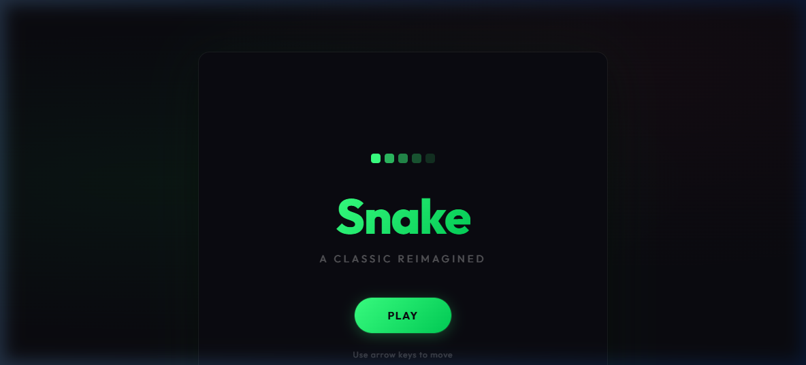

# 🐍 Snake Game

A classic Snake game built with pure HTML, CSS, and JavaScript. No frameworks, no dependencies — just open and play!

## 🎮 Live Demo

👉 https://minajuddin0510.github.io/snake-game/

## 📸 Preview



> A dark-themed Snake game with a bright green snake, red food, and smooth grid-based movement.

## 🕹️ How to Play

1. Press **Play** on the start screen to begin
2. Use the **Arrow Keys** to control the snake
3. Eat the 🔴 red food to grow longer and increase your score
4. Avoid hitting the walls or your own tail
5. When it's game over, press **Restart** to try again

## ✨ Features

- Classic grid-based Snake gameplay
- Score tracker displayed live on screen
- Game Over screen with your final score
- Restart without refreshing the page
- Clean dark UI — no external libraries needed

## 📁 Project Structure

```
snake-game/
└── index.html    # Everything in one file — HTML, CSS, and JS
```

## 🚀 Getting Started

### Option 1 — Just open it

Download or clone the repo, then open `index.html` in any browser:

```bash
git clone https://minajuddin0510.github.io/snake-game/
cd snake-game
open index.html
```

### Option 2 — Play online via GitHub Pages

1. Push `index.html` to your GitHub repo
2. Go to **Settings → Pages**
3. Set source to `main` branch, root folder
4. Your game will be live at https://minajuddin0510.github.io/snake-game/

## 🛠️ Built With

- **HTML5 Canvas**
- **CSS3**
- **Vanilla JavaScript**

## 📄 License

This project is open source and available under the [MIT License](LICENSE).

---

Made with ❤️ and a lot of arrow key tapping.

**Author:** Minaj Uddin
https://github.com/minajuddin0510
